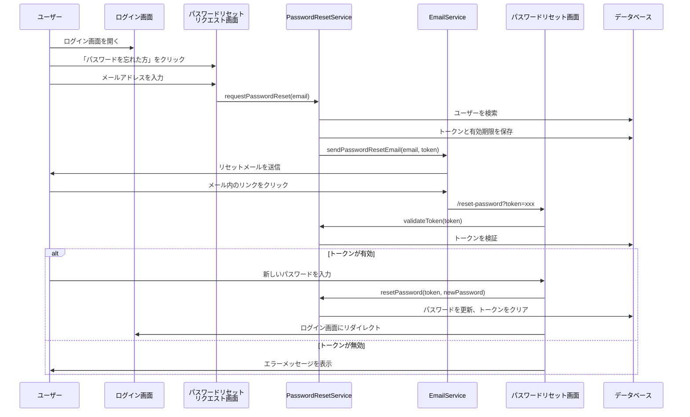

# パスワードリセット機能

## 概要

ユーザーがパスワードを忘れた場合に、メールアドレスを入力することでパスワードリセット用のトークンを含むメールを送信し、そのトークンを使用して新しいパスワードを設定できる機能です。

## 機能の流れ



## 実装内容

### 1. データベーススキーマ

`users`テーブルに以下のカラムを追加：

- `password_reset_token VARCHAR(255)` - リセットトークン（UUID）
- `password_reset_token_expiry TIMESTAMP` - トークンの有効期限（24時間）

**ファイル**: 
- `src/main/resources/schema.sql` - 新規テーブル作成時
- `src/main/resources/alter_users_add_password_reset.sql` - 既存テーブルへの追加

### 2. エンティティ

**ファイル**: `src/main/java/com/example/fleamarketsystem/entity/User.java`

```java
@Column(name = "password_reset_token")
private String passwordResetToken;

@Column(name = "password_reset_token_expiry")
private LocalDateTime passwordResetTokenExpiry;
```

### 3. リポジトリ

**ファイル**: `src/main/java/com/example/fleamarketsystem/repository/UserRepository.java`

```java
Optional<User> findByPasswordResetToken(String token);
```

### 4. サービス層

#### PasswordResetService

**ファイル**: `src/main/java/com/example/fleamarketsystem/service/PasswordResetService.java`

主なメソッド：

- `requestPasswordReset(String email)` - トークン生成とメール送信
  - UUIDでランダムなトークンを生成
  - 有効期限を24時間後に設定
  - データベースに保存
  - EmailServiceを呼び出してメール送信
  - セキュリティのため、存在しないメールアドレスでも成功メッセージを返す

- `validateToken(String token)` - トークンの有効性チェック
  - トークンが存在するか確認
  - 有効期限が切れていないか確認

- `resetPassword(String token, String newPassword)` - パスワードリセット処理
  - トークンを検証
  - パスワードを`{noop}`プレフィックスでエンコード（既存の実装と統一）
  - トークンと有効期限をクリア

#### EmailService

**ファイル**: `src/main/java/com/example/fleamarketsystem/service/EmailService.java`

- `sendPasswordResetEmail(String email, String token)` - パスワードリセットメールを送信
  - リセットリンクを含むメール本文を生成
  - 環境変数`APP_BASE_URL`からベースURLを取得（デフォルト: `http://localhost:8080`）
  - 送信元: `support@fleamarket.com`（`spring.mail.from`から取得）
  - 送信者名: `サポートチーム`（`app.mail.from-name`から取得）

### 5. コントローラー

**ファイル**: `src/main/java/com/example/fleamarketsystem/controller/PasswordResetController.java`

エンドポイント：

- `GET /forgot-password` - パスワードリセットリクエスト画面を表示
- `POST /forgot-password` - メールアドレスを受け取り、リセットメールを送信
- `GET /reset-password?token=xxx` - パスワードリセット画面を表示（トークン検証）
- `POST /reset-password` - 新しいパスワードを設定

### 6. ビュー（テンプレート）

#### forgot-password.html

**ファイル**: `src/main/resources/templates/forgot-password.html`

- メールアドレス入力フォーム
- ログイン画面と同様のデザイン（白黒基調）
- エラーメッセージ表示エリア
- 成功メッセージ表示エリア

#### reset-password.html

**ファイル**: `src/main/resources/templates/reset-password.html`

- 新しいパスワード入力フォーム（2回入力）
- パスワード表示/非表示トグル機能
- トークンが無効な場合のエラーメッセージ表示
- ログイン画面と同様のデザイン

### 7. セキュリティ設定

**ファイル**: `src/main/java/com/example/fleamarketsystem/config/SecurityConfig.java`

```java
.requestMatchers(
    "/login",
    "/register",
    "/forgot-password",    // 追加
    "/reset-password",     // 追加
    "/css/**", "/js/**", "/images/**", "/webjars/**")
.permitAll()
```

### 8. ログイン画面の更新

**ファイル**: `src/main/resources/templates/login.html`

- 「パスワードを忘れた方はこちら」リンクを追加（パスワード入力欄の下）
- パスワードリセット成功時のメッセージ表示

## メール送信設定

### 開発環境

**MailHogを使用する場合（推奨）:**
```bash
docker run -d -p 1025:1025 -p 8025:8025 --name mailhog mailhog/mailhog
# メール確認: http://localhost:8025
```

**Gmail SMTPを使用する場合:**
```bash
export MAIL_USERNAME=your-email@gmail.com
export MAIL_PASSWORD=your-app-password  # Gmailのアプリパスワード
export MAIL_FROM=your-email@gmail.com
```

### 本番環境（AWS SES）

**設定手順:**

1. AWS SESでメールアドレス/ドメインを認証
   - AWSコンソールでSESにアクセス
   - 「Verified identities」で送信元メールアドレスまたはドメインを認証

2. SMTP認証情報の取得
   - SESコンソールで「SMTP settings」に移動
   - 「Create SMTP credentials」をクリック
   - IAMユーザー名を入力して作成
   - 表示されるSMTPユーザー名とパスワードを保存

3. 環境変数の設定
```bash
export MAIL_HOST=email-smtp.ap-northeast-1.amazonaws.com  # リージョンに応じて変更
export MAIL_PORT=587
export MAIL_USERNAME=your-smtp-username
export MAIL_PASSWORD=your-smtp-password
export MAIL_FROM=support@fleamarket.com  # 認証済みメールアドレス
export MAIL_FROM_NAME=サポートチーム
export APP_BASE_URL=https://yourdomain.com  # 本番環境のベースURL
```

**application.properties設定:**
```properties
# 開発環境: ローカルSMTPサーバー（MailHogなど）またはGmail
# 本番環境: AWS SES SMTP（環境変数で設定）
spring.mail.host=${MAIL_HOST:smtp.gmail.com}
spring.mail.port=${MAIL_PORT:587}
spring.mail.username=${MAIL_USERNAME:}
spring.mail.password=${MAIL_PASSWORD:}
spring.mail.properties.mail.smtp.auth=${MAIL_SMTP_AUTH:true}
spring.mail.properties.mail.smtp.starttls.enable=${MAIL_SMTP_STARTTLS:true}
spring.mail.from=${MAIL_FROM:support@fleamarket.com}
app.mail.from-name=${MAIL_FROM_NAME:サポートチーム}
app.base-url=${APP_BASE_URL:http://localhost:8080}
```

## セキュリティ考慮事項

1. **トークンの生成**
   - ランダムなUUIDを使用（推測困難）
   - トークンはデータベースに保存され、一度使用すると無効化

2. **有効期限**
   - トークンの有効期限は24時間
   - 期限切れのトークンは使用不可

3. **情報漏洩対策**
   - 存在しないメールアドレスでも「メールを送信しました」と表示
   - これにより、登録済みメールアドレスの存在を推測できない

4. **パスワードエンコーディング**
   - パスワードは`{noop}`プレフィックスでエンコード（既存の実装と統一）
   - 本番環境ではより強力なエンコーディング（bcryptなど）を検討

5. **環境変数管理**
   - SMTP認証情報は環境変数で管理（コードに含めない）
   - 本番環境では適切なIAMポリシーを設定

## 使用方法

### ユーザー側

1. ログイン画面で「パスワードを忘れた方はこちら」をクリック
2. 登録済みのメールアドレスを入力
3. メール内のリンクをクリック
4. 新しいパスワードを2回入力（確認用）
5. パスワードをリセット
6. ログイン画面にリダイレクトされ、新しいパスワードでログイン可能

### 開発者側

**既存データベースにカラムを追加する場合:**
```bash
psql -U kt -d fleamarketdb -f src/main/resources/alter_users_add_password_reset.sql
```

**SQLスクリプト内容:**
```sql
ALTER TABLE public.users
  ADD COLUMN IF NOT EXISTS password_reset_token VARCHAR(255),
  ADD COLUMN IF NOT EXISTS password_reset_token_expiry TIMESTAMP;
```

## 技術スタック

- **Spring Boot Mail** - メール送信機能
- **JavaMailSender** - SMTP経由でメール送信
- **Thymeleaf** - テンプレートエンジン
- **PostgreSQL** - データベース
- **Spring Security** - セキュリティ設定

## ファイル一覧

### Javaファイル
- `src/main/java/com/example/fleamarketsystem/entity/User.java`
- `src/main/java/com/example/fleamarketsystem/repository/UserRepository.java`
- `src/main/java/com/example/fleamarketsystem/service/PasswordResetService.java`
- `src/main/java/com/example/fleamarketsystem/service/EmailService.java`
- `src/main/java/com/example/fleamarketsystem/controller/PasswordResetController.java`
- `src/main/java/com/example/fleamarketsystem/config/SecurityConfig.java`

### テンプレートファイル
- `src/main/resources/templates/forgot-password.html`
- `src/main/resources/templates/reset-password.html`
- `src/main/resources/templates/login.html` (更新)

### 設定ファイル
- `src/main/resources/application.properties`
- `src/main/resources/schema.sql`
- `src/main/resources/alter_users_add_password_reset.sql`

### 依存関係
- `pom.xml` - `spring-boot-starter-mail`を追加

## トラブルシューティング

### メールが届かない場合

1. **開発環境:**
   - MailHogが起動しているか確認（http://localhost:8025）
   - 環境変数が正しく設定されているか確認
   - コンソールログでエラーメッセージを確認

2. **本番環境（AWS SES）:**
   - SESでメールアドレス/ドメインが認証されているか確認
   - SMTP認証情報が正しいか確認
   - 環境変数が正しく設定されているか確認
   - SESのサンドボックス環境の制限を確認（認証済みメールアドレスにのみ送信可能）

### トークンが無効と表示される場合

- トークンの有効期限（24時間）が切れていないか確認
- トークンが既に使用されていないか確認
- URLパラメータが正しく渡されているか確認

## 今後の改善案

1. **パスワード強度チェック**
   - 最小文字数、大文字・小文字・数字・記号の組み合わせを要求

2. **レート制限**
   - 同一メールアドレスからのリセットリクエスト回数を制限

3. **ログ記録**
   - パスワードリセットの試行をログに記録（セキュリティ監査用）

4. **メールテンプレートの改善**
   - HTMLメールの対応
   - 多言語対応

5. **パスワードエンコーディングの強化**
   - bcryptなどのより強力なエンコーディング方式への移行

